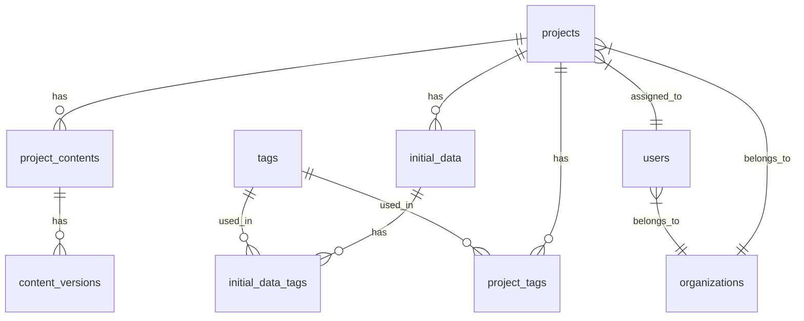

# CMO AI データベース設計書

## 1. テーブル概要

CMO AIアプリケーションのデータベースは、以下の主要なテーブルで構成されています：

- projects: プロジェクトの基本情報
- initial_data: プロジェクトの一次情報
- project_contents: プロジェクトの各ステージのAI生成コンテンツ
- content_versions: AI生成コンテンツの編集履歴
- tags: タグマスター
- project_tags: プロジェクトとタグの関連
- initial_data_tags: 一次情報とタグの関連
- users: ユーザー情報
- organizations: 組織情報

## 2. テーブル詳細

### 2.1 projects

プロジェクトの基本情報を管理するテーブル

```sql
CREATE TABLE projects (
  id UUID DEFAULT gen_random_uuid() PRIMARY KEY,
  name VARCHAR(255) NOT NULL,
  description TEXT,
  status VARCHAR(50) NOT NULL,
  stage INTEGER NOT NULL DEFAULT 1,
  total_stages INTEGER NOT NULL DEFAULT 5,
  created_at TIMESTAMP WITH TIME ZONE DEFAULT TIMEZONE('utc'::text, NOW()) NOT NULL,
  updated_at TIMESTAMP WITH TIME ZONE DEFAULT TIMEZONE('utc'::text, NOW()) NOT NULL,
  due_date TIMESTAMP WITH TIME ZONE,
  assignee_id UUID REFERENCES users(id),
  organization_id UUID REFERENCES organizations(id),
  created_by UUID REFERENCES users(id) NOT NULL,
  last_edited_by UUID REFERENCES users(id)
);
```

### 2.2 initial_data

プロジェクトの一次情報を管理するテーブル

```sql
CREATE TABLE initial_data (
  id UUID DEFAULT gen_random_uuid() PRIMARY KEY,
  project_id UUID REFERENCES projects(id) ON DELETE CASCADE NOT NULL,
  title VARCHAR(255) NOT NULL,
  content TEXT,
  data_type VARCHAR(50) NOT NULL, -- 'text', 'pdf', 'image', 'url'
  file_path TEXT, -- PDFや画像の場合のStorageパス
  url TEXT, -- URL解析の場合のソースURL
  created_at TIMESTAMP WITH TIME ZONE DEFAULT TIMEZONE('utc'::text, NOW()) NOT NULL,
  updated_at TIMESTAMP WITH TIME ZONE DEFAULT TIMEZONE('utc'::text, NOW()) NOT NULL,
  created_by UUID REFERENCES users(id) NOT NULL,
  last_edited_by UUID REFERENCES users(id)
);
```

### 2.3 project_contents

プロジェクトの各ステージのAI生成コンテンツを管理するテーブル

```sql
CREATE TABLE project_contents (
  id UUID DEFAULT gen_random_uuid() PRIMARY KEY,
  project_id UUID REFERENCES projects(id) ON DELETE CASCADE NOT NULL,
  stage_type VARCHAR(50) NOT NULL, -- 'product_summary', 'education_content', 'creative_parts', 'script'
  content TEXT NOT NULL,
  status VARCHAR(50) NOT NULL DEFAULT 'draft', -- 'draft', 'published'
  is_ai_generated BOOLEAN NOT NULL DEFAULT true,
  generation_prompt TEXT, -- AI生成時に使用したプロンプト
  created_at TIMESTAMP WITH TIME ZONE DEFAULT TIMEZONE('utc'::text, NOW()) NOT NULL,
  updated_at TIMESTAMP WITH TIME ZONE DEFAULT TIMEZONE('utc'::text, NOW()) NOT NULL,
  created_by UUID REFERENCES users(id) NOT NULL,
  last_edited_by UUID REFERENCES users(id)
);

-- ステージタイプの制約
ALTER TABLE project_contents ADD CONSTRAINT valid_stage_type 
  CHECK (stage_type IN ('product_summary', 'education_content', 'creative_parts', 'script'));
```

### 2.4 content_versions

AI生成コンテンツの編集履歴を管理するテーブル

```sql
CREATE TABLE content_versions (
  id UUID DEFAULT gen_random_uuid() PRIMARY KEY,
  project_content_id UUID REFERENCES project_contents(id) ON DELETE CASCADE NOT NULL,
  content TEXT NOT NULL,
  version_number INTEGER NOT NULL,
  is_ai_generated BOOLEAN NOT NULL DEFAULT true,
  generation_prompt TEXT, -- AI生成時に使用したプロンプト
  created_at TIMESTAMP WITH TIME ZONE DEFAULT TIMEZONE('utc'::text, NOW()) NOT NULL,
  created_by UUID REFERENCES users(id) NOT NULL,
  
  -- 同じproject_content_idに対してversion_numberはユニークである必要がある
  UNIQUE (project_content_id, version_number)
);
```

### 2.5 tags

タグのマスターデータを管理するテーブル

```sql
CREATE TABLE tags (
  id UUID DEFAULT gen_random_uuid() PRIMARY KEY,
  name VARCHAR(100) NOT NULL UNIQUE,
  created_at TIMESTAMP WITH TIME ZONE DEFAULT TIMEZONE('utc'::text, NOW()) NOT NULL,
  updated_at TIMESTAMP WITH TIME ZONE DEFAULT TIMEZONE('utc'::text, NOW()) NOT NULL
);
```

### 2.6 project_tags

プロジェクトとタグの関連を管理するテーブル

```sql
CREATE TABLE project_tags (
  project_id UUID REFERENCES projects(id) ON DELETE CASCADE,
  tag_id UUID REFERENCES tags(id) ON DELETE CASCADE,
  created_at TIMESTAMP WITH TIME ZONE DEFAULT TIMEZONE('utc'::text, NOW()) NOT NULL,
  PRIMARY KEY (project_id, tag_id)
);
```

### 2.7 initial_data_tags

一次情報とタグの関連を管理するテーブル

```sql
CREATE TABLE initial_data_tags (
  initial_data_id UUID REFERENCES initial_data(id) ON DELETE CASCADE,
  tag_id UUID REFERENCES tags(id) ON DELETE CASCADE,
  created_at TIMESTAMP WITH TIME ZONE DEFAULT TIMEZONE('utc'::text, NOW()) NOT NULL,
  PRIMARY KEY (initial_data_id, tag_id)
);
```

### 2.8 users

ユーザー情報を管理するテーブル

```sql
CREATE TABLE users (
  id UUID DEFAULT gen_random_uuid() PRIMARY KEY,
  email VARCHAR(255) NOT NULL UNIQUE,
  full_name VARCHAR(255) NOT NULL,
  organization_id UUID REFERENCES organizations(id),
  role VARCHAR(50) NOT NULL,
  created_at TIMESTAMP WITH TIME ZONE DEFAULT TIMEZONE('utc'::text, NOW()) NOT NULL,
  updated_at TIMESTAMP WITH TIME ZONE DEFAULT TIMEZONE('utc'::text, NOW()) NOT NULL,
  last_login_at TIMESTAMP WITH TIME ZONE
);
```

### 2.9 organizations

組織情報を管理するテーブル

```sql
CREATE TABLE organizations (
  id UUID DEFAULT gen_random_uuid() PRIMARY KEY,
  name VARCHAR(255) NOT NULL,
  created_at TIMESTAMP WITH TIME ZONE DEFAULT TIMEZONE('utc'::text, NOW()) NOT NULL,
  updated_at TIMESTAMP WITH TIME ZONE DEFAULT TIMEZONE('utc'::text, NOW()) NOT NULL
);
```

## 3. リレーションシップ



## 4. インデックス

主要なパフォーマンス最適化のためのインデックス：

```sql
-- プロジェクト検索の最適化
CREATE INDEX idx_projects_organization ON projects(organization_id);
CREATE INDEX idx_projects_assignee ON projects(assignee_id);
CREATE INDEX idx_projects_status ON projects(status);
CREATE INDEX idx_projects_stage ON projects(stage);

-- 一次情報検索の最適化
CREATE INDEX idx_initial_data_project ON initial_data(project_id);
CREATE INDEX idx_initial_data_type ON initial_data(data_type);

-- プロジェクトコンテンツ検索の最適化
CREATE INDEX idx_project_contents_project ON project_contents(project_id);
CREATE INDEX idx_project_contents_stage ON project_contents(stage_type);
CREATE INDEX idx_project_contents_status ON project_contents(status);

-- コンテンツバージョン検索の最適化
CREATE INDEX idx_content_versions_content ON content_versions(project_content_id);

-- タグ検索の最適化
CREATE INDEX idx_tags_name ON tags(name);
```

## 5. セキュリティ（RLS ポリシー）

Supabaseのセキュリティを確保するためのRow Level Security（RLS）ポリシー：

```sql
-- プロジェクトのRLSポリシー
ALTER TABLE projects ENABLE ROW LEVEL SECURITY;

CREATE POLICY "プロジェクトは同じ組織のユーザーのみ参照可能" ON projects
  FOR SELECT USING (
    organization_id IN (
      SELECT organization_id FROM users WHERE id = auth.uid()
    )
  );

-- 一次情報のRLSポリシー
ALTER TABLE initial_data ENABLE ROW LEVEL SECURITY;

CREATE POLICY "一次情報は関連プロジェクトの組織ユーザーのみ参照可能" ON initial_data
  FOR SELECT USING (
    project_id IN (
      SELECT id FROM projects WHERE organization_id IN (
        SELECT organization_id FROM users WHERE id = auth.uid()
      )
    )
  );

-- プロジェクトコンテンツのRLSポリシー
ALTER TABLE project_contents ENABLE ROW LEVEL SECURITY;

CREATE POLICY "プロジェクトコンテンツは関連プロジェクトの組織ユーザーのみ参照可能" ON project_contents
  FOR SELECT USING (
    project_id IN (
      SELECT id FROM projects WHERE organization_id IN (
        SELECT organization_id FROM users WHERE id = auth.uid()
      )
    )
  );
```

## 6. 注意事項

1. すべてのテーブルで`created_at`と`updated_at`を自動管理
2. 外部キー制約による参照整合性の確保
3. UUIDを主キーとして使用し、予測不可能なIDを実現
4. タグは再利用可能なマスターデータとして管理
5. 一次情報とプロジェクトの多対多関連を考慮した設計
6. AI生成コンテンツの履歴管理と編集追跡が可能
7. 各ステージのコンテンツを個別に管理し、バージョン管理も実装