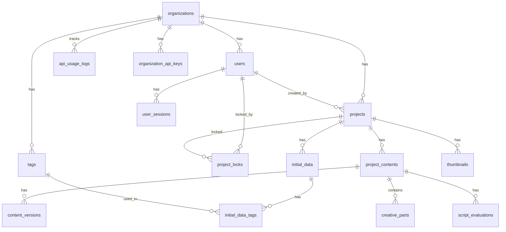

# CMO AI データベース設計書（修正版）

## 1. 組織・ユーザー管理

### 1.1 organizations

## 9. セキュリティ（RLS ポリシー）sql
CREATE TABLE organizations (
  id UUID DEFAULT gen_random_uuid() PRIMARY KEY,
  name VARCHAR(100) NOT NULL,
  slug VARCHAR(50) UNIQUE NOT NULL,
  plan VARCHAR(50) NOT NULL DEFAULT 'starter', -- 'trial', 'starter', 'standard', 'pro'
  max_concurrent_users INTEGER NOT NULL DEFAULT 2, -- プラン別の同時使用上限
  trial_ends_at TIMESTAMP WITH TIME ZONE,
  created_at TIMESTAMP WITH TIME ZONE DEFAULT TIMEZONE('utc'::text, NOW()) NOT NULL,
  updated_at TIMESTAMP WITH TIME ZONE DEFAULT TIMEZONE('utc'::text, NOW()) NOT NULL
);

-- プランの制約
ALTER TABLE organizations ADD CONSTRAINT valid_plan 
  CHECK (plan IN ('trial', 'starter', 'standard', 'pro'));
```

### 1.2 users

```sql
CREATE TABLE users (
  id UUID DEFAULT gen_random_uuid() PRIMARY KEY,
  email VARCHAR(255) UNIQUE NOT NULL,
  organization_id UUID REFERENCES organizations(id) ON DELETE CASCADE NOT NULL,
  role VARCHAR(50) NOT NULL DEFAULT 'member', -- 'admin', 'member', 'viewer'
  full_name VARCHAR(100),
  avatar_url TEXT,
  is_active BOOLEAN NOT NULL DEFAULT true,
  last_login_at TIMESTAMP WITH TIME ZONE,
  created_at TIMESTAMP WITH TIME ZONE DEFAULT TIMEZONE('utc'::text, NOW()) NOT NULL,
  updated_at TIMESTAMP WITH TIME ZONE DEFAULT TIMEZONE('utc'::text, NOW()) NOT NULL
);

-- ロールの制約
ALTER TABLE users ADD CONSTRAINT valid_role 
  CHECK (role IN ('admin', 'member', 'viewer'));
```

### 1.3 user_sessions

ユーザーセッション・ログイン履歴管理

```sql
CREATE TABLE user_sessions (
  id UUID DEFAULT gen_random_uuid() PRIMARY KEY,
  user_id UUID REFERENCES users(id) ON DELETE CASCADE NOT NULL,
  session_token VARCHAR(255) UNIQUE NOT NULL,
  ip_address INET,
  user_agent TEXT,
  is_active BOOLEAN NOT NULL DEFAULT true,
  expires_at TIMESTAMP WITH TIME ZONE NOT NULL,
  created_at TIMESTAMP WITH TIME ZONE DEFAULT TIMEZONE('utc'::text, NOW()) NOT NULL,
  ended_at TIMESTAMP WITH TIME ZONE
);
```

## 2. プロジェクト管理

### 2.1 projects

```sql
CREATE TABLE projects (
  id UUID DEFAULT gen_random_uuid() PRIMARY KEY,
  organization_id UUID REFERENCES organizations(id) ON DELETE CASCADE NOT NULL,
  name VARCHAR(200) NOT NULL,
  description TEXT,
  status VARCHAR(50) NOT NULL DEFAULT 'active', -- 'active', 'archived', 'deleted'
  created_at TIMESTAMP WITH TIME ZONE DEFAULT TIMEZONE('utc'::text, NOW()) NOT NULL,
  updated_at TIMESTAMP WITH TIME ZONE DEFAULT TIMEZONE('utc'::text, NOW()) NOT NULL,
  created_by UUID REFERENCES users(id) NOT NULL,
  assigned_to UUID REFERENCES users(id)
);

-- ステータスの制約
ALTER TABLE projects ADD CONSTRAINT valid_status 
  CHECK (status IN ('active', 'archived', 'deleted'));
```

### 2.2 project_locks

プロジェクトの排他制御管理

```sql
CREATE TABLE project_locks (
  id UUID DEFAULT gen_random_uuid() PRIMARY KEY,
  project_id UUID REFERENCES projects(id) ON DELETE CASCADE NOT NULL,
  locked_by UUID REFERENCES users(id) NOT NULL,
  locked_at TIMESTAMP WITH TIME ZONE DEFAULT TIMEZONE('utc'::text, NOW()) NOT NULL,
  expires_at TIMESTAMP WITH TIME ZONE NOT NULL,
  last_activity_at TIMESTAMP WITH TIME ZONE DEFAULT TIMEZONE('utc'::text, NOW()) NOT NULL,
  
  -- 1つのプロジェクトに対して1つのロックのみ許可
  UNIQUE(project_id)
);
```

### 2.3 tags

タグマスター（再利用可能）

```sql
CREATE TABLE tags (
  id UUID DEFAULT gen_random_uuid() PRIMARY KEY,
  organization_id UUID REFERENCES organizations(id) ON DELETE CASCADE NOT NULL,
  name VARCHAR(50) NOT NULL,
  color VARCHAR(7) DEFAULT '#3B82F6', -- HEXカラーコード
  is_default BOOLEAN NOT NULL DEFAULT false, -- 「商品情報」「ユーザー情報」「広告情報」
  created_at TIMESTAMP WITH TIME ZONE DEFAULT TIMEZONE('utc'::text, NOW()) NOT NULL,
  created_by UUID REFERENCES users(id),
  
  -- 組織内でのタグ名の重複を防ぐ
  UNIQUE (organization_id, name)
);
```

### 2.4 initial_data

初期情報データ

```sql
CREATE TABLE initial_data (
  id UUID DEFAULT gen_random_uuid() PRIMARY KEY,
  project_id UUID REFERENCES projects(id) ON DELETE CASCADE NOT NULL,
  title VARCHAR(200) NOT NULL,
  content TEXT NOT NULL,
  data_type VARCHAR(50) NOT NULL, -- 'text', 'pdf', 'url'
  source_url TEXT, -- URL解析の場合
  file_path TEXT, -- PDFアップロードの場合
  created_at TIMESTAMP WITH TIME ZONE DEFAULT TIMEZONE('utc'::text, NOW()) NOT NULL,
  updated_at TIMESTAMP WITH TIME ZONE DEFAULT TIMEZONE('utc'::text, NOW()) NOT NULL,
  created_by UUID REFERENCES users(id) NOT NULL
);

-- データタイプの制約
ALTER TABLE initial_data ADD CONSTRAINT valid_data_type 
  CHECK (data_type IN ('text', 'pdf', 'url'));
```

### 2.5 initial_data_tags

初期情報とタグの関連

```sql
CREATE TABLE initial_data_tags (
  id UUID DEFAULT gen_random_uuid() PRIMARY KEY,
  initial_data_id UUID REFERENCES initial_data(id) ON DELETE CASCADE NOT NULL,
  tag_id UUID REFERENCES tags(id) ON DELETE CASCADE NOT NULL,
  created_at TIMESTAMP WITH TIME ZONE DEFAULT TIMEZONE('utc'::text, NOW()) NOT NULL,
  
  -- 同じ初期情報に同じタグの重複を防ぐ
  UNIQUE (initial_data_id, tag_id)
);
```

### 2.6 project_contents

プロジェクトの各ステージのAI生成コンテンツを管理するテーブル

```sql
CREATE TABLE project_contents (
  id UUID DEFAULT gen_random_uuid() PRIMARY KEY,
  project_id UUID REFERENCES projects(id) ON DELETE CASCADE NOT NULL,
  stage_type VARCHAR(50) NOT NULL, -- 'product_summary', 'education_content', 'creative_parts', 'script'
  content TEXT NOT NULL,
  status VARCHAR(50) NOT NULL DEFAULT 'draft', -- 'draft', 'published'
  is_ai_generated BOOLEAN NOT NULL DEFAULT true,
  generation_prompt TEXT, -- AI生成時に使用したプロンプト（秘匿情報除く）
  variant_number INTEGER DEFAULT 1, -- バリエーション番号（台本の場合1-2）
  is_selected BOOLEAN DEFAULT false, -- 選択されたバリエーションかどうか
  created_at TIMESTAMP WITH TIME ZONE DEFAULT TIMEZONE('utc'::text, NOW()) NOT NULL,
  updated_at TIMESTAMP WITH TIME ZONE DEFAULT TIMEZONE('utc'::text, NOW()) NOT NULL,
  created_by UUID REFERENCES users(id) NOT NULL,
  last_edited_by UUID REFERENCES users(id)
);

-- ステージタイプの制約
ALTER TABLE project_contents ADD CONSTRAINT valid_stage_type 
  CHECK (stage_type IN ('product_summary', 'education_content', 'creative_parts', 'script'));

-- ステータスの制約
ALTER TABLE project_contents ADD CONSTRAINT valid_status 
  CHECK (status IN ('draft', 'published'));
```

### 2.7 creative_parts

クリエイティブパーツの詳細情報を管理するテーブル

```sql
CREATE TABLE creative_parts (
  id UUID DEFAULT gen_random_uuid() PRIMARY KEY,
  project_content_id UUID REFERENCES project_contents(id) ON DELETE CASCADE NOT NULL,
  part_type VARCHAR(50) NOT NULL, -- 'pain_point', 'target', 'action', 'cause', 'concept'
  content TEXT NOT NULL,
  order_index INTEGER NOT NULL,
  created_at TIMESTAMP WITH TIME ZONE DEFAULT TIMEZONE('utc'::text, NOW()) NOT NULL,
  updated_at TIMESTAMP WITH TIME ZONE DEFAULT TIMEZONE('utc'::text, NOW()) NOT NULL,
  
  -- 同じproject_content_idに対してorder_indexはユニークである必要がある
  UNIQUE (project_content_id, order_index)
);

-- パーツタイプの制約
ALTER TABLE creative_parts ADD CONSTRAINT valid_part_type 
  CHECK (part_type IN ('pain_point', 'target', 'action', 'cause', 'concept'));
```

### 2.8 thumbnails

サムネイル画像情報を管理するテーブル

```sql
CREATE TABLE thumbnails (
  id UUID DEFAULT gen_random_uuid() PRIMARY KEY,
  project_id UUID REFERENCES projects(id) ON DELETE CASCADE NOT NULL,
  image_url TEXT NOT NULL,
  storage_path TEXT NOT NULL,
  aspect_ratio VARCHAR(20) NOT NULL, -- '9:16', '16:9', '1:1', '4:5'
  prompt TEXT, -- DALL-E生成時のプロンプト
  status VARCHAR(50) NOT NULL DEFAULT 'generated', -- 'generating', 'generated', 'failed'
  created_at TIMESTAMP WITH TIME ZONE DEFAULT TIMEZONE('utc'::text, NOW()) NOT NULL,
  created_by UUID REFERENCES users(id) NOT NULL
);

-- アスペクト比の制約
ALTER TABLE thumbnails ADD CONSTRAINT valid_aspect_ratio 
  CHECK (aspect_ratio IN ('9:16', '16:9', '1:1', '4:5'));

-- ステータスの制約
ALTER TABLE thumbnails ADD CONSTRAINT valid_thumbnail_status 
  CHECK (status IN ('generating', 'generated', 'failed'));
```

### 2.9 script_evaluations

広告台本の評価情報を管理するテーブル

```sql
CREATE TABLE script_evaluations (
  id UUID DEFAULT gen_random_uuid() PRIMARY KEY,
  project_content_id UUID REFERENCES project_contents(id) ON DELETE CASCADE NOT NULL,
  evaluation_type VARCHAR(50) NOT NULL, -- 'expression', 'structure', 'information_volume', 'information_quality', 'education', 'creativity'
  score INTEGER NOT NULL CHECK (score >= 1 AND score <= 10),
  comment TEXT,
  created_at TIMESTAMP WITH TIME ZONE DEFAULT TIMEZONE('utc'::text, NOW()) NOT NULL,
  created_by UUID REFERENCES users(id) NOT NULL,
  
  -- 同じproject_content_idと評価タイプの組み合わせはユニークである必要がある
  UNIQUE (project_content_id, evaluation_type, created_by)
);

-- 評価タイプの制約（要件定義書に合わせて修正）
ALTER TABLE script_evaluations ADD CONSTRAINT valid_evaluation_type 
  CHECK (evaluation_type IN ('expression', 'structure', 'information_volume', 'information_quality', 'education', 'creativity'));
```

## 3. API使用量管理

### 3.1 api_usage_logs

API使用量ログの詳細追跡

```sql
CREATE TABLE api_usage_logs (
  id UUID DEFAULT gen_random_uuid() PRIMARY KEY,
  organization_id UUID REFERENCES organizations(id) ON DELETE CASCADE NOT NULL,
  user_id UUID REFERENCES users(id) ON DELETE CASCADE NOT NULL,
  project_id UUID REFERENCES projects(id) ON DELETE CASCADE,
  api_provider VARCHAR(50) NOT NULL, -- 'openai', 'claude', 'gemini', 'deepseek'
  api_type VARCHAR(50) NOT NULL, -- 'text_generation', 'image_generation'
  operation_type VARCHAR(50) NOT NULL, -- 'product_summary', 'education_content', 'creative_parts', 'script', 'thumbnail'
  tokens_used INTEGER DEFAULT 0,
  images_generated INTEGER DEFAULT 0,
  cost_estimated DECIMAL(10,4) DEFAULT 0,
  request_payload_size INTEGER, -- リクエストサイズ（バイト）
  response_size INTEGER, -- レスポンスサイズ（バイト）
  processing_time_ms INTEGER, -- 処理時間（ミリ秒）
  status VARCHAR(50) NOT NULL DEFAULT 'success', -- 'success', 'failed', 'timeout'
  error_message TEXT,
  created_at TIMESTAMP WITH TIME ZONE DEFAULT TIMEZONE('utc'::text, NOW()) NOT NULL
);

-- APIプロバイダーの制約
ALTER TABLE api_usage_logs ADD CONSTRAINT valid_api_provider 
  CHECK (api_provider IN ('openai', 'claude', 'gemini', 'deepseek'));

-- APIタイプの制約
ALTER TABLE api_usage_logs ADD CONSTRAINT valid_api_type 
  CHECK (api_type IN ('text_generation', 'image_generation'));

-- ステータスの制約
ALTER TABLE api_usage_logs ADD CONSTRAINT valid_api_status 
  CHECK (status IN ('success', 'failed', 'timeout'));
```

### 3.2 organization_api_keys

組織のAPIキー管理

```sql
CREATE TABLE organization_api_keys (
  id UUID DEFAULT gen_random_uuid() PRIMARY KEY,
  organization_id UUID REFERENCES organizations(id) ON DELETE CASCADE NOT NULL,
  api_provider VARCHAR(50) NOT NULL,
  encrypted_api_key TEXT NOT NULL, -- 暗号化されたAPIキー
  key_name VARCHAR(100), -- キーの説明名
  is_active BOOLEAN NOT NULL DEFAULT true,
  last_validated_at TIMESTAMP WITH TIME ZONE,
  validation_status VARCHAR(50) DEFAULT 'pending', -- 'pending', 'valid', 'invalid'
  created_at TIMESTAMP WITH TIME ZONE DEFAULT TIMEZONE('utc'::text, NOW()) NOT NULL,
  created_by UUID REFERENCES users(id) NOT NULL,
  updated_at TIMESTAMP WITH TIME ZONE DEFAULT TIMEZONE('utc'::text, NOW()) NOT NULL,
  
  -- 組織・プロバイダーごとに1つのアクティブキーのみ
  UNIQUE (organization_id, api_provider, is_active) DEFERRABLE INITIALLY DEFERRED
);

-- APIプロバイダーの制約
ALTER TABLE organization_api_keys ADD CONSTRAINT valid_api_key_provider 
  CHECK (api_provider IN ('openai', 'claude', 'gemini', 'deepseek'));

-- バリデーションステータスの制約
ALTER TABLE organization_api_keys ADD CONSTRAINT valid_validation_status 
  CHECK (validation_status IN ('pending', 'valid', 'invalid'));
```

## 4. バージョン管理・履歴

### 4.1 content_versions

コンテンツのバージョン履歴

```sql
CREATE TABLE content_versions (
  id UUID DEFAULT gen_random_uuid() PRIMARY KEY,
  project_content_id UUID REFERENCES project_contents(id) ON DELETE CASCADE NOT NULL,
  version_number INTEGER NOT NULL,
  content TEXT NOT NULL,
  change_summary TEXT,
  created_at TIMESTAMP WITH TIME ZONE DEFAULT TIMEZONE('utc'::text, NOW()) NOT NULL,
  created_by UUID REFERENCES users(id) NOT NULL,
  
  -- 同じproject_content_idに対してversion_numberはユニークである必要がある
  UNIQUE (project_content_id, version_number)
);
```

## 5. リレーションシップ



## 6. インデックス

主要なパフォーマンス最適化のためのインデックス：

```sql
-- 組織・ユーザー関連
CREATE INDEX idx_users_organization ON users(organization_id);
CREATE INDEX idx_users_email ON users(email);
CREATE INDEX idx_user_sessions_user ON user_sessions(user_id);
CREATE INDEX idx_user_sessions_active ON user_sessions(is_active, expires_at);

-- プロジェクト関連
CREATE INDEX idx_projects_organization ON projects(organization_id);
CREATE INDEX idx_projects_status ON projects(status);
CREATE INDEX idx_project_locks_project ON project_locks(project_id);
CREATE INDEX idx_project_locks_expires ON project_locks(expires_at);

-- タグ関連
CREATE INDEX idx_tags_organization ON tags(organization_id);
CREATE INDEX idx_initial_data_tags_data ON initial_data_tags(initial_data_id);
CREATE INDEX idx_initial_data_tags_tag ON initial_data_tags(tag_id);

-- コンテンツ関連
CREATE INDEX idx_initial_data_project ON initial_data(project_id);
CREATE INDEX idx_project_contents_project ON project_contents(project_id);
CREATE INDEX idx_project_contents_stage ON project_contents(stage_type);
CREATE INDEX idx_project_contents_variant ON project_contents(project_id, stage_type, variant_number);

-- クリエイティブパーツ関連
CREATE INDEX idx_creative_parts_content ON creative_parts(project_content_id);
CREATE INDEX idx_creative_parts_type ON creative_parts(part_type);

-- サムネイル関連
CREATE INDEX idx_thumbnails_project ON thumbnails(project_id);
CREATE INDEX idx_thumbnails_status ON thumbnails(status);

-- 評価関連
CREATE INDEX idx_script_evaluations_content ON script_evaluations(project_content_id);
CREATE INDEX idx_script_evaluations_type ON script_evaluations(evaluation_type);

-- API使用量関連
CREATE INDEX idx_api_usage_organization ON api_usage_logs(organization_id);
CREATE INDEX idx_api_usage_user ON api_usage_logs(user_id);
CREATE INDEX idx_api_usage_provider ON api_usage_logs(api_provider);
CREATE INDEX idx_api_usage_created_at ON api_usage_logs(created_at);
CREATE INDEX idx_api_usage_organization_date ON api_usage_logs(organization_id, created_at);

-- APIキー関連
CREATE INDEX idx_organization_api_keys_org ON organization_api_keys(organization_id);
CREATE INDEX idx_organization_api_keys_provider ON organization_api_keys(api_provider);

-- バージョン管理関連
CREATE INDEX idx_content_versions_content ON content_versions(project_content_id);
CREATE INDEX idx_content_versions_version ON content_versions(version_number);
```

## 7. セキュリティ（RLS ポリシー）

```sql
-- ユーザーのRLSポリシー
ALTER TABLE users ENABLE ROW LEVEL SECURITY;

CREATE POLICY "ユーザーは同一組織のユーザーのみ参照可能" ON users
  FOR SELECT USING (
    organization_id IN (
      SELECT organization_id FROM users WHERE id = auth.uid()
    )
  );

-- プロジェクトのRLSポリシー
ALTER TABLE projects ENABLE ROW LEVEL SECURITY;

CREATE POLICY "プロジェクトは同一組織のユーザーのみ参照可能" ON projects
  FOR SELECT USING (
    organization_id IN (
      SELECT organization_id FROM users WHERE id = auth.uid()
    )
  );

-- プロジェクトロックのRLSポリシー
ALTER TABLE project_locks ENABLE ROW LEVEL SECURITY;

CREATE POLICY "プロジェクトロックは関連プロジェクトの組織ユーザーのみ参照可能" ON project_locks
  FOR SELECT USING (
    project_id IN (
      SELECT id FROM projects WHERE organization_id IN (
        SELECT organization_id FROM users WHERE id = auth.uid()
      )
    )
  );

-- 初期データのRLSポリシー
ALTER TABLE initial_data ENABLE ROW LEVEL SECURITY;

CREATE POLICY "初期データは関連プロジェクトの組織ユーザーのみ参照可能" ON initial_data
  FOR SELECT USING (
    project_id IN (
      SELECT id FROM projects WHERE organization_id IN (
        SELECT organization_id FROM users WHERE id = auth.uid()
      )
    )
  );

-- プロジェクトコンテンツのRLSポリシー
ALTER TABLE project_contents ENABLE ROW LEVEL SECURITY;

CREATE POLICY "プロジェクトコンテンツは関連プロジェクトの組織ユーザーのみ参照可能" ON project_contents
  FOR SELECT USING (
    